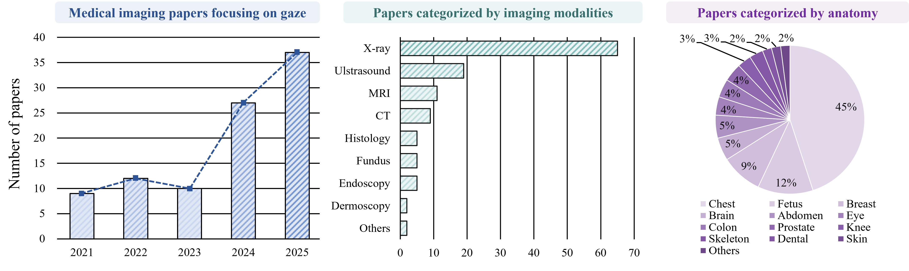
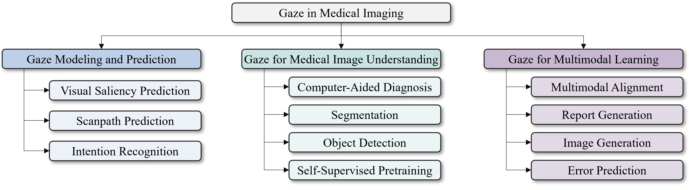
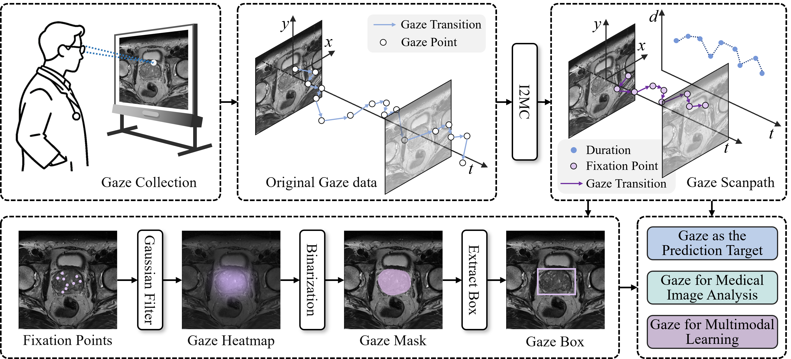

# Gaze in Medical Imaging: A Comprehensive Review

> Computer-aided medical image analysis plays a critical role in clinical diagnosis. However, several challenges remain unresolved, including high annotation costs and limited model interpretability. Such limitations hinder clinical applicability and reduce clinician confidence. As a form of behavioral data that captures visual inspection trajectories, eye-tracking information can be seamlessly integrated into routine clinical workflows and has demonstrated considerable potential for addressing these challenges. Consequently, increasing attention has been directed toward gaze-based medical imaging research.
A systematic review of gaze applications in medical imaging is presented. The fundamental concepts and processing pipeline of gaze data are first introduced. Existing studies are then comprehensively reviewed and categorized from two perspectives. From the application perspective, related research is grouped into three major directions: gaze prediction, gaze-assisted medical image analysis, and gaze-driven cross-modal learning and human--computer interaction. Within each application category, studies are further classified according to the functional role of gaze information, including data fusion, supervisory signals, and evaluation and interpretability analysis. In addition, publicly available eye-tracking datasets in medical imaging are systematically summarized. Current limitations and practical challenges are also analyzed, followed by a discussion of potential future research directions.
The review provides a comprehensive overview of the emerging interdisciplinary area that integrates eye-tracking and medical imaging. A structured reference framework is established to support future investigations and facilitate continued advances in the field.

> Left: The number of medical imaging publications focusing on gaze has increased rapidly.
Middle: The distribution of papers in the survey across imaging modalities; modalities with relatively few studies, such as PET, are grouped under “Others.”
Right: The distribution of papers across different organs; less frequently studied organs, including the heart, vessels, and pancreas, are grouped under “Others.”

> A taxonomy of gaze-based studies in the field of medical imaging.

> A brief overview of gaze utilization pipelines across various applications.

## Part 1: Gaze Modeling and Prediction
### 1.1 Visual Saliency Prediction

* Ultrasound Image Representation Learning by Modeling Sonographer Visual Attention.  
**Information Processing in Medical Imaging (IPMI) (2019)** 
[[Paper](https://link.springer.com/chapter/10.1007/978-3-030-20351-1_46)]

* Towards Capturing Sonographic Experience: Cognition-Inspired Ultrasound Video Saliency Prediction.  
**Annual Conference on Medical Image Understanding and Analysis (2019)** 
[[Paper](https://link.springer.com/chapter/10.1007/978-3-030-39343-4_15)]

* First Trimester Gaze Pattern Estimation Using Stochastic Augmentation Policy Search for Single Frame Saliency Prediction.  
**Medical Image Understanding and Analysis (2021)** 
[[Paper](https://link.springer.com/chapter/10.1007/978-3-030-80432-9_28)]

* First Trimester Video Saliency Prediction Using CLSTMU-Net with Stochastic Augmentation.  
**2022 IEEE 19th International Symposium on Biomedical Imaging (ISBI) (2022)** 
[[Paper](https://ieeexplore.ieee.org/abstract/document/9761585)]

* Multi-Task UNet: Jointly Boosting Saliency Prediction and Disease Classification on Chest X-Ray Images.  
**arXiv preprint (2022)** 
[[Paper](https://arxiv.org/abs/2202.07118)]

* Predicting Radiologists' Gaze with Computational Saliency Models in Mammogram Reading.  
**IEEE Transactions on Multimedia (2024)** 
[[Paper](https://ieeexplore.ieee.org/abstract/document/10089554)]

* Gaze-Directed Vision GNN for Mitigating Shortcut Learning in Medical Image.  
**International Conference on Medical Image Computing and Computer-Assisted Intervention (MICCAI) (2024)** 
[[Paper](https://link.springer.com/chapter/10.1007/978-3-031-72378-0_48)]

* Time-Interval Visual Saliency Prediction in Mammogram Reading.  
**IEEE International Conference on Acoustics, Speech and Signal Processing (ICASSP) (2024)** 
[[Paper](https://ieeexplore.ieee.org/abstract/document/10446593)]

* ItpCtrl-AI: End-to-End Interpretable and Controllable Artificial Intelligence by Modeling Radiologists' Intentions.  
**Artificial Intelligence in Medicine (2025)** 
[[Paper](https://www.sciencedirect.com/science/article/pii/S0933365724002963)]

* Joint Enhancement of Automatic Chest X-Ray Diagnosis and Radiological Gaze Prediction with Multistage Cooperative Learning.  
**Medical Physics (2025)** 
[[Paper](https://pmc.ncbi.nlm.nih.gov/articles/PMC12264402/)]

* Chest X-Ray Visual Saliency Modeling: Eye-Tracking Dataset and Saliency Prediction Model.  
**IEEE Transactions on Neural Networks and Learning Systems (2025)** 
[[Paper](https://ieeexplore.ieee.org/abstract/document/10993309/)]

### 1.2 Fixation and Scanpath Prediction

* Discovering Salient Anatomical Landmarks by Predicting Human Gaze.  
**2020 IEEE 17th International Symposium on Biomedical Imaging (ISBI) (2020)** 
[[Paper](https://ieeexplore.ieee.org/abstract/document/9098505/)]

* Multimodal-GuideNet: Gaze-Probe Bidirectional Guidance in Obstetric Ultrasound Scanning.  
**Medical Image Computing and Computer Assisted Intervention (MICCAI) (2022)** 
[[Paper](https://link.springer.com/chapter/10.1007/978-3-031-16449-1_10)]

* GEM: Context-Aware Gaze EstiMation with Visual Search Behavior Matching for Chest Radiograph.  
**Medical Image Computing and Computer Assisted Intervention (MICCAI) (2024)** 
[[Paper](https://link.springer.com/chapter/10.1007/978-3-031-72378-0_49)]

* GazeSearch: Radiology Findings Search Benchmark.  
**2025 IEEE/CVF Winter Conference on Applications of Computer Vision (WACV) (2025)**
[[Paper](https://ieeexplore.ieee.org/abstract/document/10943557)]

* CT-ScanGaze: A Dataset and Baselines for 3D Volumetric Scanpath Modeling.  
**Proceedings of the IEEE/CVF International Conference on Computer Vision (ICCV) (2025)** 
[[Paper](https://openaccess.thecvf.com/content/ICCV2025/html/Pham_CT-ScanGaze_A_Dataset_and_Baselines_for_3D_Volumetric_Scanpath_Modeling_ICCV_2025_paper.html)]

* Deep Learning Quantifies Pathologists' Visual Patterns for Whole Slide Image Diagnosis.  
**Nature Communications (2025)** 
[[Paper](https://www.nature.com/articles/s41467-025-60307-1)]

* From Human Attention to Diagnosis: Semantic Patch-Level Integration of Vision-Language Models in Medical Imaging.  
**Advances in Neural Information Processing Systems (NIPS) (2025)** 
[[Paper](https://proceedings.neurips.cc/paper_files/paper/2025/hash/be7bc8aa38696723cebe296b6122d7e3-Abstract-Conference.html)]

### 1.3 Intent Recognition

* Can a Machine Learn from Radiologists' Visual Search Behaviour and Their Interpretation of Mammograms—A Deep-Learning Study.  
**Journal of Digital Imaging (2019)** 
[[Paper](https://link.springer.com/article/10.1007/s10278-018-00174-z)]

* Towards Scale and Position Invariant Task Classification Using Normalised Visual Scanpaths in Clinical Fetal Ultrasound.  
**International Workshop on Advances in Simplifying Medical Ultrasound (2021)** 
[[Paper](https://link.springer.com/chapter/10.1007/978-3-030-87583-1_13)]

* Interpreting Radiologist's Intention from Eye Movements in Chest X-Ray Diagnosis.  
**Proceedings of the 33rd ACM International Conference on Multimedia (ACM MM) (2025)** 
[[Paper](https://dl.acm.org/doi/abs/10.1145/3746027.3755039)]

## Part 2: Gaze for Medical Image Understanding

### 2.1 Computer-Aided Diagnosis

* Multi-Task SonoEyeNet: Detection of Fetal Standardized Planes Assisted by Generated Sonographer Attention Maps.  
**Medical Image Computing and Computer Assisted Intervention (MICCAI) (2018)** 
[[Paper](https://link.springer.com/chapter/10.1007/978-3-030-00928-1_98)]

* SonoEyeNet: Standardized Fetal Ultrasound Plane Detection Informed by Eye Tracking.  
**2018 IEEE 15th International Symposium on Biomedical Imaging (ISBI) (2018)** 
[[Paper](https://ieeexplore.ieee.org/abstract/document/8363851/)]

* Attention Based Glaucoma Detection: A Large-Scale Database and CNN Model.  
**Proceedings of the IEEE/CVF Conference on Computer Vision and Pattern Recognition (CVPR) (2019)** 
[[Paper](http://openaccess.thecvf.com/content_CVPR_2019/html/Li_Attention_Based_Glaucoma_Detection_A_Large-Scale_Database_and_CNN_Model_CVPR_2019_paper.html)]

* A Collaborative Computer Aided Diagnosis (C-CAD) System with Eye-Tracking, Sparse Attentional Model, and Deep Learning.  
**Medical Image Analysis (2019)** 
[[Paper](https://www.sciencedirect.com/science/article/pii/S1361841518308570)]

* Spatio-Temporal Visual Attention Modelling of Standard Biometry Plane-Finding Navigation.  
**Medical Image Analysis (2020)** 
[[Paper](https://www.sciencedirect.com/science/article/pii/S1361841520301262)]

* Observational Supervision for Medical Image Classification Using Gaze Data.  
**Medical Image Computing and Computer Assisted Intervention (MICCAI) (2021)** 
[[Paper](https://link.springer.com/chapter/10.1007/978-3-030-87196-3_56)]

* Leveraging Human Selective Attention for Medical Image Analysis with Limited Training Data.  
**arXiv preprint (2021)** 
[[Paper](https://arxiv.org/abs/2112.01034)]

* Follow My Eye: Using Gaze to Supervise Computer-Aided Diagnosis.  
**IEEE Transactions on Medical Imaging (2022)** 
[[Paper](https://ieeexplore.ieee.org/abstract/document/9694633/)]

* RadioTransformer: A Cascaded Global-Focal Transformer for Visual Attention-Guided Disease Classification.  
**European Conference on Computer Vision (ECCV) (2022)** 
[[Paper](https://link.springer.com/chapter/10.1007/978-3-031-19803-8_40)]

* Gaze-Guided Class Activation Mapping: Leverage Human Visual Attention for Network Attention in Chest X-Rays Classification.  
**Proceedings of the 15th International Symposium on Visual Information Communication and Interaction (2022)** 
[[Paper](https://dl.acm.org/doi/abs/10.1145/3554944.3554952)]

* Eye-Gaze-Guided Vision Transformer for Rectifying Shortcut Learning.  
**IEEE Transactions on Medical Imaging (2023)** 
[[Paper](https://ieeexplore.ieee.org/abstract/document/10155473/)]

* Mammo-Net: Integrating Gaze Supervision and Interactive Information in Multi-View Mammogram Classification.  
**Medical Image Computing and Computer Assisted Intervention (MICCAI) (2023)** 
[[Paper](https://link.springer.com/chapter/10.1007/978-3-031-43990-2_7)]

* Probabilistic Integration of Object Level Annotations in Chest X-Ray Classification.  
**Proceedings of the IEEE/CVF Winter Conference on Applications of Computer Vision (WACV) (2023)** 
[[Paper](https://openaccess.thecvf.com/content/WACV2023/html/van_Sonsbeek_Probabilistic_Integration_of_Object_Level_Annotations_in_Chest_X-Ray_Classification_WACV_2023_paper.html)]

* GazeGNN: A Gaze-Guided Graph Neural Network for Chest X-Ray Classification.  
**Proceedings of the IEEE/CVF Winter Conference on Applications of Computer Vision (WACV) (2024)** 
[[Paper](https://openaccess.thecvf.com/content/WACV2024/html/Wang_GazeGNN_A_Gaze-Guided_Graph_Neural_Network_for_Chest_X-Ray_Classification_WACV_2024_paper.html)]

* DCAMIL: Eye-Tracking Guided Dual-Cross-Attention Multi-Instance Learning for Refining Fundus Disease Detection.  
**Expert Systems with Applications (2024)** 
[[Paper](https://www.sciencedirect.com/science/article/pii/S0957417423033912)]

* Follow Sonographers' Visual Scan-Path: Adjusting CNN Model for Diagnosing Gout from Musculoskeletal Ultrasound.  
**Medical Image Computing and Computer Assisted Intervention (MICCAI) (2024)** 
[[Paper](https://link.springer.com/chapter/10.1007/978-3-031-72378-0_57)]

* Seeing Through Expert's Eyes: Leveraging Radiologist Eye Gaze and Speech Report with Graph Neural Networks for Chest X-Ray Image Classification.  
**Proceedings of the Asian Conference on Computer Vision (ACCV) (2024)** 
[[Paper](https://openaccess.thecvf.com/content/ACCV2024/html/Sultana_Seeing_Through_Experts_Eyes_Leveraging_Radiologist_Eye_Gaze_and_Speech_ACCV_2024_paper.html)]

* EMS: A Large-Scale Eye Movement Dataset, Benchmark, and New Model for Schizophrenia Recognition.  
**IEEE Transactions on Neural Networks and Learning Systems (2025)** 
[[Paper](https://ieeexplore.ieee.org/abstract/document/10645682)]

* Thinking Like Sonographers: Human-Centered CNN Models for Gout Diagnosis From Musculoskeletal Ultrasound.  
**IEEE Transactions on Biomedical Engineering (2025)** 
[[Paper](https://ieeexplore.ieee.org/abstract/document/10772401)]

* EG-SpikeFormer: Eye-Gaze Guided Transformer on Spiking Neural Networks for Medical Image Analysis.  
**2025 IEEE 22nd International Symposium on Biomedical Imaging (ISBI) (2025)** 
[[Paper](https://ieeexplore.ieee.org/abstract/document/10980855)]

* Dermatologist-Like Explainable AI Enhances Melanoma Diagnosis Accuracy: Eye-Tracking Study.  
**Nature Communications (2025)** 
[[Paper](https://www.nature.com/articles/s41467-023-43095-4)]

### 2.2 Segmentation

* Iterative Multi-Path Tracking for Video and Volume Segmentation with Sparse Point Supervision.  
**Medical Image Analysis (2018)**
[[Paper](https://www.sciencedirect.com/science/article/pii/S1361841518306637)]

* A Collaborative Computer Aided Diagnosis (C-CAD) System with Eye-Tracking, Sparse Attentional Model, and Deep Learning.  
**Medical Image Analysis (2019)** 
[[Paper](https://www.sciencedirect.com/science/article/pii/S1361841518308570)]

* Eye Tracking for Deep Learning Segmentation Using Convolutional Neural Networks.  
**Journal of Digital Imaging (2019)** 
[[Paper](https://link.springer.com/article/10.1007/s10278-019-00220-4)]

* Eye-Guided Dual-Path Network for Multi-Organ Segmentation of Abdomen.  
**Medical Image Computing and Computer Assisted Intervention (MICCAI) (2023)** 
[[Paper](https://link.springer.com/chapter/10.1007/978-3-031-43990-2_3)]

* GlanceSeg: Real-Time Microaneurysm Lesion Segmentation with Gaze-Map-Guided Foundation Model for Early Detection of Diabetic Retinopathy.  
**IEEE Journal of Biomedical and Health Informatics (2024)** 
[[Paper](https://ieeexplore.ieee.org/abstract/document/10472575)]

* Weakly-Supervised Medical Image Segmentation with Gaze Annotations.  
**Medical Image Computing and Computer Assisted Intervention (MICCAI) (2024)** 
[[Paper](https://link.springer.com/chapter/10.1007/978-3-031-72384-1_50)]

* Integrating Eye Tracking With Grouped Fusion Networks for Semantic Segmentation on Mammogram Images.  
**IEEE Transactions on Medical Imaging (2025)** 
[[Paper](https://ieeexplore.ieee.org/abstract/document/10697394)]

* Enjoying Information Dividend: Gaze Track-Based Medical Weakly Supervised Segmentation.  
**Medical Image Computing and Computer Assisted Intervention (MICCAI) (2025)** 
[[Paper](https://link.springer.com/chapter/10.1007/978-3-032-05127-1_20)]

* From Gaze to Insight: Bridging Human Visual Attention and Vision Language Model Explanation for Weakly-Supervised Medical Image Segmentation.  
**IEEE Transactions on Medical Imaging (2025)** 
[[Paper](https://ieeexplore.ieee.org/abstract/document/11186285)]

* Adaptation Follow Human Attention: Gaze-Assisted Medical Segment Anything Model.  
**IEEE Transactions on Circuits and Systems for Video Technology (2025)** 
[[Paper](https://ieeexplore.ieee.org/abstract/document/11079704)]

* Gaze-Guided Robotic Vascular Ultrasound Leveraging Human Intention Estimation.  
**IEEE Robotics and Automation Letters (2025)** 
[[Paper](https://ieeexplore.ieee.org/abstract/document/10878457)]

* Graph-Based Neighbor-Aware Network for Gaze-Supervised Medical Image Segmentation.  
**Medical Image Computing and Computer Assisted Intervention (MICCAI) (2025)** 
[[Paper](https://link.springer.com/chapter/10.1007/978-3-032-04965-0_22)]

* Human Gaze-Based Dual Teacher Guidance Learning for Semi-Supervised Medical Image Segmentation.  
**Neural Networks (2025)** 
[[Paper](https://www.sciencedirect.com/science/article/pii/S0893608025007452)]

### 2.3 Detection

* Automatic Lung Nodule Detection Combined With Gaze Information Improves Radiologists' Screening Performance.  
**IEEE Journal of Biomedical and Health Informatics (2020)** 
[[Paper](https://ieeexplore.ieee.org/abstract/document/9007735)]

* On Smart Gaze Based Annotation of Histopathology Images for Training of Deep Convolutional Neural Networks.  
**IEEE Journal of Biomedical and Health Informatics (2022)** 
[[Paper](https://ieeexplore.ieee.org/abstract/document/9706338)]

* GazeRadar: A Gaze and Radiomics-Guided Disease Localization Framework.  
**Medical Image Computing and Computer Assisted Intervention (MICCAI) (2022)** 
[[Paper](https://link.springer.com/chapter/10.1007/978-3-031-16437-8_66)]

* Integrating Eye-Gaze Data into CXR DL Approaches: A Preliminary Study.  
**2023 IEEE Conference on Virtual Reality and 3D User Interfaces Abstracts and Workshops (VRW) (2023)** 
[[Paper](https://ieeexplore.ieee.org/abstract/document/10108506)]

* Supporting Mitosis Detection AI Training with Inter-Observer Eye-Gaze Consistencies.  
**2024 IEEE 12th International Conference on Healthcare Informatics (ICHI) (2024)** 
[[Paper](https://ieeexplore.ieee.org/abstract/document/10628541)]

* Gaze-DETR: Using Expert Gaze to Reduce False Positives in Vulvovaginal Candidiasis Screening.  
**Medical Image Computing and Computer Assisted Intervention (MICCAI) (2024)** 
[[Paper](https://link.springer.com/chapter/10.1007/978-3-031-72083-3_13)]

* Query-Level Alignment for End-to-End Lesion Detection with Human Gaze.  
**Medical Image Computing and Computer Assisted Intervention (MICCAI) (2025)** 
[[Paper](https://link.springer.com/chapter/10.1007/978-3-032-05169-1_48)]

### 2.4 Self-Supervised Pretraining

* Ultrasound Image Representation Learning by Modeling Sonographer Visual Attention.  
**Information Processing in Medical Imaging (IPMI) (2019)** 
[[Paper](https://link.springer.com/chapter/10.1007/978-3-030-20351-1_46)]

* Contrastive Learning Approach to Predict Radiologist's Error Based on Gaze Data.  
**2023 IEEE Congress on Evolutionary Computation (CEC) (2023)** 
[[Paper](https://ieeexplore.ieee.org/abstract/document/10254056)]

* Crafting Good Views of Medical Images for Contrastive Learning via Expert-Level Visual Attention.  
**Proceedings of The 2nd Gaze Meets ML Workshop (2024)**
[[Paper](https://proceedings.mlr.press/v226/wang24b.html)]

* Taming Masked Image Modeling for Chest X-Ray Diagnosis by Incorporating Clinical Visual Priors.  
**International Conference on Information Processing in Medical Imaging (IPMI) (2025)** 
[[Paper](https://link.springer.com/chapter/10.1007/978-3-031-96625-5_11)]

* Mining Gaze for Contrastive Learning Toward Computer-Assisted Diagnosis.  
**Proceedings of the AAAI Conference on Artificial Intelligence (AAAI) (2024)** 
[[Paper](https://ojs.aaai.org/index.php/AAAI/article/view/28586)]

* Improving Self-Supervised Medical Image Pre-Training by Early Alignment With Human Eye Gaze Information.  
**IEEE Transactions on Medical Imaging (2025)** 
[[Paper](https://ieeexplore.ieee.org/abstract/document/10839445)]

* Learning Better Contrastive View from Radiologist's Gaze.  
**Pattern Recognition (2025)** 
[[Paper](https://www.sciencedirect.com/science/article/pii/S003132032500010X)]

## Part 3: Gaze for Multimodal Learning

### 3.1 Multimodal Alignment 

* Eye-Gaze Guided Multi-Modal Alignment for Medical Representation Learning.  
**Advances in Neural Information Processing Systems (NIPS) (2024)** 
[[Paper](https://proceedings.neurips.cc/paper_files/paper/2024/hash/0b9536e186a77feff516893a5f393f7a-Abstract-Conference.html)]

* Improving Medical Multi-Modal Contrastive Learning with Expert Annotations.  
**European Conference on Computer Vision (ECCV) (2025)** 
[[Paper](https://link.springer.com/chapter/10.1007/978-3-031-72661-3_27)]

### 3.2 Report Generation

* Gaze-Assisted Automatic Captioning of Fetal Ultrasound Videos Using Three-Way Multi-Modal Deep Neural Networks.  
**Medical Image Analysis (2022)** 
[[Paper](https://www.sciencedirect.com/science/article/pii/S1361841522002584)]

* Enhancing Human-Computer Interaction in Chest X-Ray Analysis Using Vision and Language Model with Eye Gaze Patterns.  
**Medical Image Computing and Computer Assisted Intervention (MICCAI) (2024)** 
[[Paper](https://link.springer.com/chapter/10.1007/978-3-031-72384-1_18)]

* Eye Gaze Guided Cross-Modal Alignment Network for Radiology Report Generation.  
**IEEE Journal of Biomedical and Health Informatics (2024)** 
[[Paper](https://ieeexplore.ieee.org/abstract/document/10596697/)]

* FG-CXR: A Radiologist-Aligned Gaze Dataset for Enhancing Interpretability in Chest X-Ray Report Generation.  
**Proceedings of the Asian Conference on Computer Vision (ACCV) (2024)** 
[[Paper](https://openaccess.thecvf.com/content/ACCV2024/html/Pham_FG-CXR_A_Radiologist-Aligned_Gaze_Dataset_for_Enhancing_Interpretability_in_Chest_ACCV_2024_paper.html)]

* Eyes on the Image: Gaze Supervised Multimodal Learning for Chest X-Ray Diagnosis and Report Generation.  
**arXiv preprint (2025)** 
[[Paper](https://arxiv.org/abs/2508.13068)]

* Look & Mark: Leveraging Radiologist Eye Fixations and Bounding Boxes in Multimodal Large Language Models for Chest X-Ray Report Generation.  
**Findings of the Association for Computational Linguistics: ACL (2025)** 
[[Paper](https://aclanthology.org/2025.findings-acl.909/)]

* RadEyeVideo: Enhancing General-Domain Large Vision Language Model for Chest X-Ray Analysis with Video Representations of Eye Gaze.  
**arXiv preprint (2025)** 
[[Paper](https://arxiv.org/abs/2507.09097)]

### 3.3 Image Generation

* Misjudging the Machine: Gaze May Forecast Human-Machine Team Performance in Surgery.  
**Medical Image Computing and Computer Assisted Intervention (MICCAI) (2024)** 
[[Paper](https://link.springer.com/chapter/10.1007/978-3-031-72089-5_38)]

* GazeDiff: A Radiologist Visual Attention Guided Diffusion Model for Zero-Shot Disease Classification.  
**Proceedings of The 7th International Conference on Medical Imaging with Deep Learning (2024)** 
[[Paper](https://openreview.net/forum?id=sUbcVVy8IU)]

* RadGazeGen: Radiomics and Gaze-Guided Medical Image Generation Using Diffusion Models.  
**arXiv preprint (2024)** 
[[Paper](https://arxiv.org/abs/2410.00307)]

* Eyes Tell the Truth: GazeVal Highlights Shortcomings of Generative AI in Medical Imaging.  
**Proceedings of the IEEE/CVF Conference on Computer Vision and Pattern Recognition (CVPR) Workshops (2025)** 
[[Paper](https://openaccess.thecvf.com/content/CVPR2025W/SyntaGen/html/Wong_Eyes_Tell_the_Truth_GazeVal_Highlights_Shortcomings_of_Generative_AI_CVPRW_2025_paper.html)]

* Shifts in Doctors' Eye Movements Between Real and AI-Generated Medical Images.  
**Proceedings of the 2025 Symposium on Eye Tracking Research and Applications (ETRA '25) (2025)** 
[[Paper](https://dl.acm.org/doi/abs/10.1145/3715669.3726789)]

### 3.4 Error Prediction

* Prediction of Radiological Diagnostic Errors from Eye Tracking Data Using Graph Neural Networks and Gaze-Guided Transformers.  
**Graphs in Biomedical Image Analysis (2025)** 
[[Paper](https://link.springer.com/chapter/10.1007/978-3-031-83243-7_4)]

* Prediction of Radiological Decision Errors from Longitudinal Analysis of Gaze and Image Features.  
**Artificial Intelligence in Medicine (2025)** 
[[Paper](https://www.sciencedirect.com/science/article/pii/S0933365724002938)]

* Longitudinal Anatomical Attention Maps for Recognizing Diagnostic Errors from Radiologists' Eye Movements.  
**Medical Image Computing and Computer Assisted Intervention (MICCAI) (2025)** 
[[Paper](https://link.springer.com/chapter/10.1007/978-3-032-04981-0_30)]

* Collaborative Integration of AI and Human Expertise to Improve Detection of Chest Radiograph Abnormalities.  
**Radiology: Artificial Intelligence (2025)** 
[[Paper](https://pubs.rsna.org/doi/abs/10.1148/ryai.240277)]

## Part 4: Datasets

* **EGD-CXR**:  
Creation and Validation of a Chest X-Ray Dataset with Eye-Tracking and Report Dictation for AI Development.  
**Scientific Data (2021)** [[Paper](https://github.com/cxr-eye-gaze/eye-gaze-dataset)]

* **CXR-P**:   
Observational Supervision for Medical Image Classification Using Gaze Data.  
**Medical Image Computing and Computer Assisted Intervention (MICCAI) (2021)** [[Paper](https://github.com/HazyResearch/observational)]

* **REFLACX**:   
REFLACX: A Dataset of Reports and Eye-Tracking Data for Localization of Abnormalities in Chest X-Rays.  
**Scientific Data (2022)** [[Paper](https://physionet.org/content/reflacx-xray-localization/1.0.0/)]

* **TDD**:  
Tufts Dental Database: A Multimodal Panoramic X-Ray Dataset for Benchmarking Diagnostic Systems.  
**IEEE Journal of Biomedical and Health Informatics (2022)** [[Paper](http://tdd.ece.tufts.edu/)]

* **FG-CXR**  
FG-CXR: A Radiologist-Aligned Gaze Dataset for Enhancing Interpretability in Chest X-Ray Report Generation.  
**Proceedings of the Asian Conference on Computer Vision (ACCV) (2024)** [[Paper](https://github.com/UARK-AICV/FG-CXR)]

* **AMD-Gaze**:  
DCAMIL: Eye-Tracking Guided Dual-Cross-Attention Multi-Instance Learning for Refining Fundus Disease Detection.  
**Expert Systems with Applications (2024)** [[Paper](https://github.com/hyman1020/GazeMap-Fundus)]

* **DR-Gaze**:  
DCAMIL: Eye-Tracking Guided Dual-Cross-Attention Multi-Instance Learning for Refining Fundus Disease Detection.  
**Expert Systems with Applications (2024)** [[Paper](https://github.com/hyman1020/GazeMap-Fundus)]

* **GazeSearch**:  
GazeSearch: Radiology Findings Search Benchmark.  
**2025 IEEE/CVF Winter Conference on Applications of Computer Vision (WACV) (2025)** [[Paper](https://github.com/UARK-AICV/GazeSearch)]

* **CT-ScanGaze**:  
CT-ScanGaze: A Dataset and Baselines for 3D Volumetric Scanpath Modeling.  
**Proceedings of the IEEE/CVF International Conference on Computer Vision (ICCV) (2025)** [[Paper](https://github.com/UARK-AICV/CTScanGaze)]

* **EMS**:  
EMS: A Large-Scale Eye Movement Dataset, Benchmark, and New Model for Schizophrenia Recognition.  
**IEEE Transactions on Neural Networks and Learning Systems (2025)** [[Paper](https://github.com/YingjieSong1/EMS)]

* **PathoGaze1.0**:  
Eye-Tracking, Mouse Tracking, Stimulus Tracking, and Decision-Making Datasets in Digital Pathology.  
**arXiv preprint (2025)** [[Paper](https://go.osu.edu/pathogaze)]

* **Diagnosed-Gaze++**:  
ItpCtrl-AI: End-to-End Interpretable and Controllable Artificial Intelligence by Modeling Radiologists' Intentions.  
**Artificial Intelligence in Medicine (2025)** [[Paper](https://github.com/UARK-AICV/ItpCtrl-AI)]

* GAA-DETR: Query-Level Alignment for End-to-End Lesion Detection with Human Gaze.  
**Medical Image Computing and Computer Assisted Intervention (MICCAI) (2025)** [[Paper](https://github.com/YanKong0408/GAA-DETR)]

* Dermatologist-Like Explainable AI Enhances Melanoma Diagnosis Accuracy: Eye-Tracking Study.  
**Nature Communications (2025)** [[Paper](https://figshare.com/s/5f0b0f18c20f0a850dc7)]
